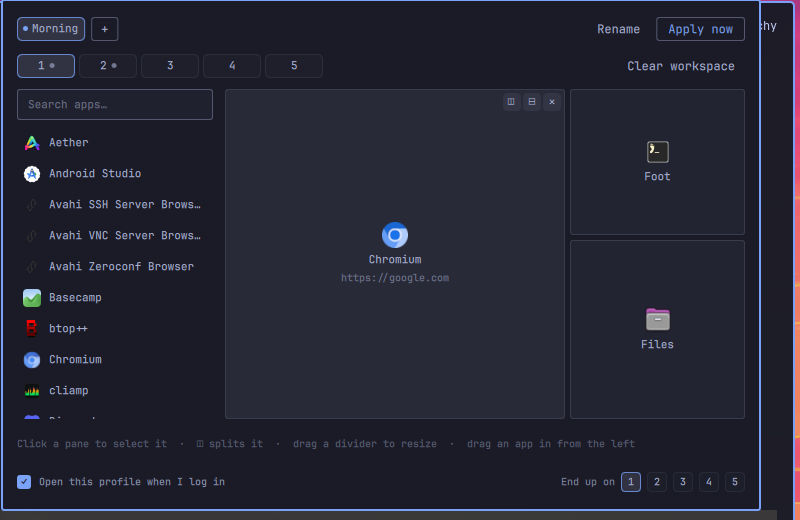

# Workspace Profiles

An [Omarchy](https://omarchy.org) plugin that opens your session for you.

Say which apps belong on which workspace and drag out the tiling layout they
should open into. Mark one profile as your login profile and the whole thing
builds itself the first time you log in, announced by a notification and nothing
else — no dialog, no click.



The layouts are real tiling layouts, not floating windows placed by hand. What
you draw on the canvas is the dwindle tree Hyprland ends up with, ratios and
all, so the result is something you can go on using with your normal keybinds.

## Install

```bash
omarchy plugin add https://github.com/imRYiUK/omarchy-workspace-profiles.git --enable
```

Then click the ◫ icon in your bar.

To remove it:

```bash
omarchy plugin remove io.github.imryiuk.workspace-profiles
```

## Using it

**The editor** opens on a left click of the bar icon.

- **Profiles** run along the top. `+` makes another, `Rename` renames the one
  you are on, and a dot on a chip marks the profile that runs at login.
- **Workspaces 1–5** are the row below. A dot means something is set up there.
- **Search for an app** on the left, then either click it onto the selected pane
  or drag it onto any pane.
- **Split a pane** with the `◫` buttons that appear when you hover it — the
  first splits side by side, the second top and bottom. `✕` removes a pane and
  gives its space back to its neighbour.
- **Drag a divider** to set how the space is shared. Double-click one to even it
  up again.
- **Drag one pane onto another** to swap them.
- **Arguments** for the selected pane go in the field under the canvas. This is
  what turns "open Chromium" into "open Chromium on google.com", and it takes
  ordinary command-line arguments, so `-e btop` works on a terminal.
- **End up on** picks the workspace you are left looking at once everything has
  opened.

**Apply now** builds the profile immediately. So does a right click on the bar
icon, which is the quicker way once a profile is set up.

Keyboard, while the editor is open: `1`–`5` switch workspace, arrows move
between panes, `s` and `S` split the selected pane, `x` removes it, `/` jumps to
the search box, `a` applies the profile, `Esc` closes.

### At login

Tick **Open this profile when I log in**. It applies once per login: restarting
the shell (`omarchy-restart-shell`) or having it respawn after a crash will not
open a second copy of everything, because the marker that records "already done"
lives in `$XDG_RUNTIME_DIR`, which the system clears when you log out.

A workspace that already has windows on it is left alone. The first app of a
layout is meant to fill the workspace and every split is measured from there, so
building into an occupied workspace would nest your layout inside whatever was
already open. You get a notification saying which workspaces were skipped.

### From a keybinding

The plugin registers two IPC targets, so a profile can be launched without
touching the bar. In `~/.config/hypr/bindings.lua`:

```lua
o.bind("SUPER + SHIFT + P", "Apply workspace profile", "omarchy-shell workspace-profiles apply morning")
o.bind("SUPER + ALT + P", "Edit workspace profiles", "omarchy-shell io.github.imryiuk.workspace-profiles toggle")
```

| Call | Effect |
|---|---|
| `omarchy-shell workspace-profiles apply <id>` | apply a profile by id |
| `omarchy-shell workspace-profiles applyActive` | apply the selected profile |
| `omarchy-shell workspace-profiles applyLogin` | the login run, marker check included |
| `omarchy-shell io.github.imryiuk.workspace-profiles toggle` | open or close the editor |

## Bar settings

Both are optional, set on the widget's entry in `~/.config/omarchy/shell.json`:

| Key | Default | What it does |
|---|---|---|
| `showProfileName` | `false` | put the active profile's name beside the icon |
| `notify` | `true` | send a notification when a profile is applied |

## How the layout actually gets built

Hyprland's dwindle layout has exactly one structural move: split an existing
window in two. There is no "arrange these five windows like this". So a saved
layout is rebuilt from the top down.

At each split, the window already filling that region is focused, a
`preselect` layout message aims the next window at the chosen side, and the app
is launched into it:

```
realize(node, seed):                # seed currently fills node's rectangle
  if node is a leaf:  done          # seed is this pane's window
  else:
    focus(seed)
    layoutmsg preselect  r | d
    new = launch(leftmost leaf of node.b)
    realize(node.a, seed)
    realize(node.b, new)
```

Walking the splits in pre-order means the window a step needs to divide always
exists already. `lib/plan.jq` turns a tree into that step list;
`bin/workspace-profiles-apply` runs it.

Ratios are set right after each split rather than in a pass at the end. At that
moment each half is a single window, so a resize lands on exactly that split;
once the halves have been subdivided further, the same resize would be absorbed
by the innermost split instead.

The orchestration is a shell script rather than QML because it is sequential and
blocking — it waits for each window to map before aiming the next one — and the
Omarchy shell is a single long-running process that should not be waiting on
anything.

## Where things are kept

| Path | What |
|---|---|
| `~/.config/omarchy/workspace-profiles/profiles.json` | your profiles |
| `$XDG_RUNTIME_DIR/omarchy-workspace-profiles/applied` | the once-per-login marker |

`profiles.json` is plain and hand-editable. A layout is a binary tree, the same
shape as dwindle's:

```json
{
  "version": 1,
  "activeProfile": "morning",
  "loginProfile": "morning",
  "profiles": [{
    "id": "morning",
    "name": "Morning",
    "focusWorkspace": 1,
    "workspaces": {
      "1": { "root": {
        "type": "split", "dir": "v", "ratio": 0.62,
        "a": { "type": "leaf", "app": "chromium", "args": "https://google.com" },
        "b": { "type": "split", "dir": "h", "ratio": 0.4,
               "a": { "type": "leaf", "app": "foot", "args": "" },
               "b": { "type": "leaf", "app": "org.gnome.Nautilus", "args": "" } } } }
    }
  }]
}
```

`dir` is `"v"` for side by side and `"h"` for stacked; `ratio` is the share
taken by child `a`; `app` is a desktop entry id.

## Requirements

Omarchy 4 with the Quickshell bar, Hyprland 0.56 or newer (the plugin uses the
Lua dispatch API), and the `jq` and `uwsm-app` that Omarchy already installs.
Workspaces must be using the **dwindle** layout — `preselect` is a dwindle
message, and a workspace switched to `scrolling` will open the apps in order
without the splits.

## Development

```bash
git clone https://github.com/imRYiUK/omarchy-workspace-profiles.git
cd omarchy-workspace-profiles

node tests/model.test.js     # tree operations and canvas geometry
tests/plan.test.sh           # the launch plan, step by step

scripts/install              # copy into ~/.config/omarchy/plugins/ and rescan
```

The launcher can be driven without the UI, which is the fastest way to work on
the layout half:

```bash
bin/workspace-profiles-apply --profile morning --dry-run   # print the plan
bin/workspace-profiles-apply --profile morning             # actually build it
```

Note that Quickshell caches plugin QML — `scripts/install` picks up edits, but
if a change seems not to have landed, `omarchy-restart-shell` forces a clean
reload.

## Not there yet

Per-pane float and fullscreen, workspaces beyond 5, multi-monitor placement,
"save my current desktop as a profile", and exporting profiles. The data model
has room for all of them.

## License

MIT
